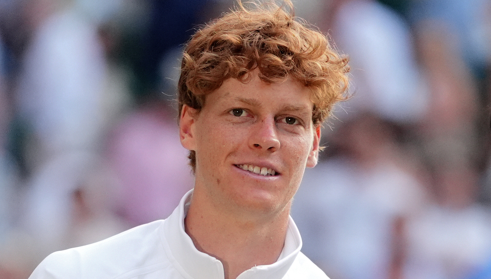

# Tennis CLI



Il tool definitivo per il te(nnis)rminale ha bisogno di piu tennis e meno logica.

Con `tennis`, scegli il tuo colpo, e lui ti mette il tennis che vuoi.

## Tennis disponibili

- `tennis` salva `sinnet.jpg`
- `tennis -racchetta` salva `racchetta.jpg`
- `tennis -pallina` salva `pallina.jpg`

## Regole del tennis

- Di default(ennis) salva nella directory corrente(nnis)
- Con `-servizio "PATH"` salva nella directory indicata
- Se la directory di `-servizio` non esiste(nnis), viene creata
- Se il file esiste(nnis) già, il comando si ferma
- Per sovrascrivere devi battere il file rivale e ti tocca fare un `--matchpoint`

## Installazione del tennis

Requisiti:

- Python 3.9+
- Consigliato `pipx` per avere il comando globale

### Installare pipx

Verifica prima se `pipx` e gia disponibile:

```bash
pipx --version
```

macOS (Homebrew):

```bash
brew install pipx
pipx ensurepath
```

Linux:

```bash
sudo apt update
sudo apt install -y pipx
pipx ensurepath
```

Linux (alternativa):

```bash
python3 -m pip install --user pipx
python3 -m pipx ensurepath
```

Windows:

```powershell
py -m pip install --user pipx
py -m pipx ensurepath
```

Dopo `ensurepath`, chiudi e riapri il terminale.

Da GitHub:

```bash
pipx install git+https://github.com/includepetrol/Tennis.git
```

Alternativa con pip:

```bash
python -m pip install git+https://github.com/includepetrol/Tennis.git
```

## Tennis rapidi

```bash
tennis
tennis -racchetta
tennis -pallina
tennis -racchetta -servizio "./meme/finale"
tennis -pallina -servizio "~/Desktop/tennis"
tennis -racchetta --matchpoint
```

## Sviluppo locale del tennis

```bash
python -m pip install -e .
tennis
```

## Compatibilità del tennis

Il tennis è universale per macOS, Windows e Linux.
